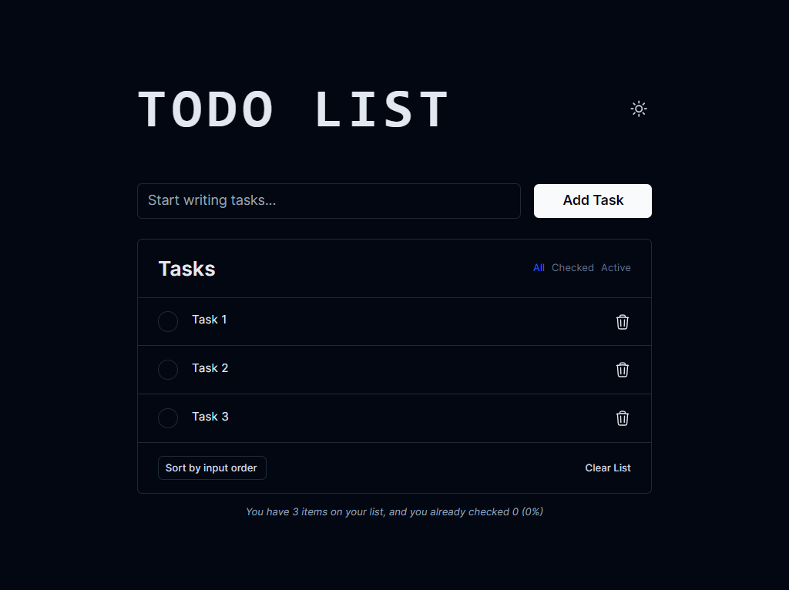

# Todo App

This is a simple todo app built with React and TailwindCSS.

## Features

- Add new tasks
- Mark tasks as completed
- Delete tasks
- Filter tasks by status (all/completed/active)
- sort tasks by date (order/alphabetical/checked)
- Clear all completed tasks
- localStorage to persist tasks

## Screenshots

## Installation

1. Clone the repository: `git clone https://github.com/moashraf86/todo-app.git`
2. Install dependencies: `npm install`
3. Start the development server: `npm run dev`

## License

This project is licensed under the [MIT License](LICENSE).
